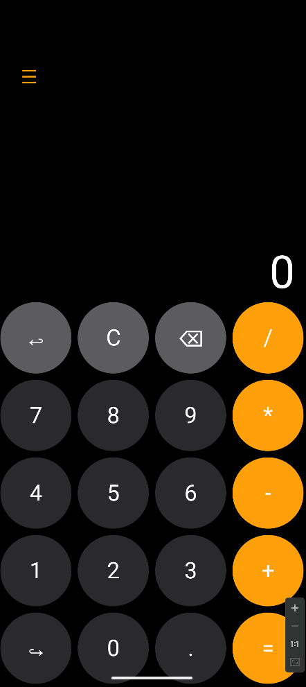

# Calculator + Scientific mode

+ Jetpack Compose
+ Calculation (+ - * /, fractions, $\pi$, $e$, $\sqrt(x)$, $x^2$, $ln(x)$)
+ State management (mutableStateOf, callback functions)
+ Command pattern
+ Undo/Redo
+ Some custom written components
+ Beautiful UI

## TO-DO:
+ Text Resize
+ Fix grid resize lag
+ Toggle Scientific mode nicely
